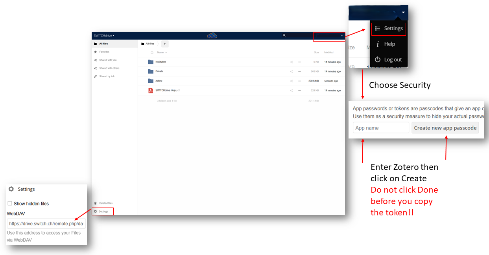

# Reference Management

## Use Switch Drive WebDAV Service for Zotero

1. You have a [Switch Drive](https://drive.switch.ch/) account, and you are using Zotero for reference management.

2. Go to Zotero and open "Edit -> Settings -> Sync", in File Syncing, change Zotero to WebDAV. Before you can Verify Server, you will need to enter **URL**, **Username** and **Password**.
   
   - On Switch Drive page, click bottom left "Settings" and you will see an address. Use this address as **URL** in Zotero.
   
   - Use your email address as **Username** in Zotero.
   
   - On Switch Drive page, click top right your name and then choose "Settings -> Security". You will see a place to link your App: Enter App name (eg. Zotero) and then click "Create new app passcode". **Do not click "Done" before you copy the password / token!** Use this token as **Password** in Zotero.

3. After entering these information, click "Verify Server" in Zotero and it's done!

